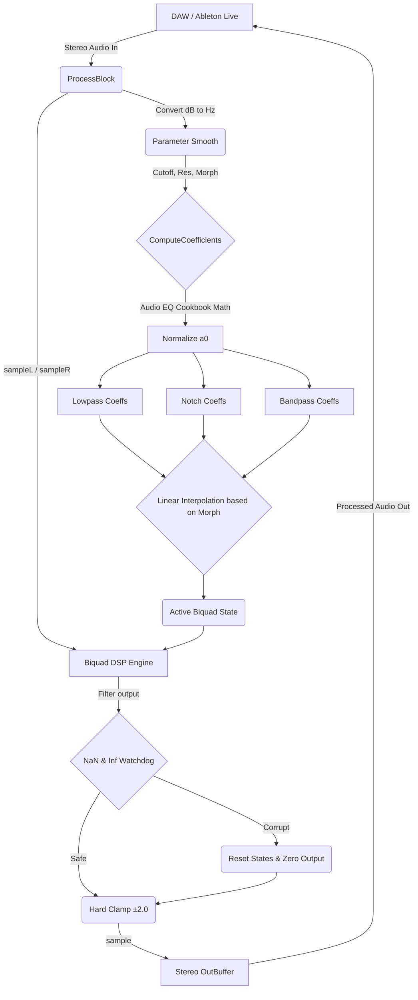

# EwolFX Z-Plane Filter

A highly optimized, hardware-accelerated VST3 plugin modeling the iconic E-mu Z-Plane filter morphology. It utilizes a zero-delay feedback biquad engine designed for smooth interpolations between 3 highly resonant topologies.

## Core Features
- **Z-Plane Morphing**: Seamlessly interpolates between three unique filter states on the fly without zipper noise or `NaN` explosions.
  - **Morph 0.0 (Lowpass)**: Classic 2nd-order resonant lowpass filter.
  - **Morph 0.5 (Notch/Phaser)**: A sharp, phase-cancelling notch filter perfect for sweeping "whoosh" sounds.
  - **Morph 1.0 (Vocal Formant)**: A tight, highly resonant bandpass filter mimicking vocal tract acoustics.
- **Hardware-Accelerated UI**: Built using NanoVG + Metal on macOS, providing a zero-overhead, 60fps glassmorphic user interface.
- **Agentic Code Structure**: Fully componentized `EWOL` control framework designed to be easily extensible and generated by local LLMs (like Qwen 3.6 27b).

## Data Flow Model
Below is the DSP Data Flow Diagram representing the lifecycle of audio samples passing through the EwolFX framework:

## How to use for LLM Generation
This codebase is explicitly templated for an AI Agent to expand on. 
1. **Controls**: All UI knobs, buttons, and backgrounds should use `EWControls::EWKnob`, `EWPanel`, etc.
2. **Styling**: Do not use standard `IPlug2` styles. The `EWOL` framework uses direct `Draw()` overrides to guarantee perfect geometric alignment and modern aesthetics.
3. **DSP**: Always use standard Audio EQ Cookbook mathematics for Biquads and ensure coefficients are normalized against `a0`. Add hard-clamp and NaN-protections inside `ProcessBlock` to prevent DAW redlining during experimental AI-generated DSP code.
